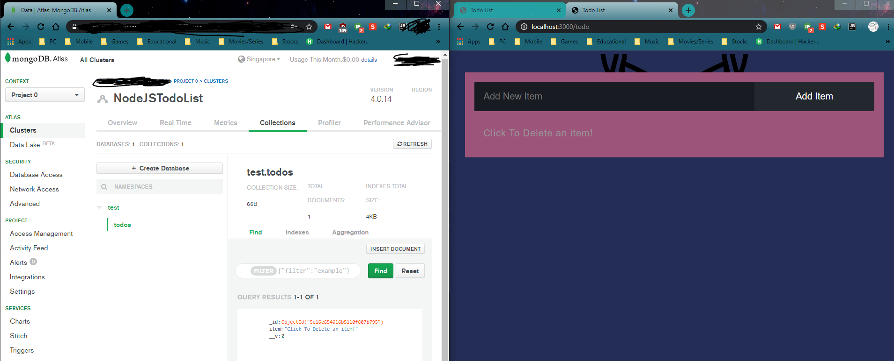
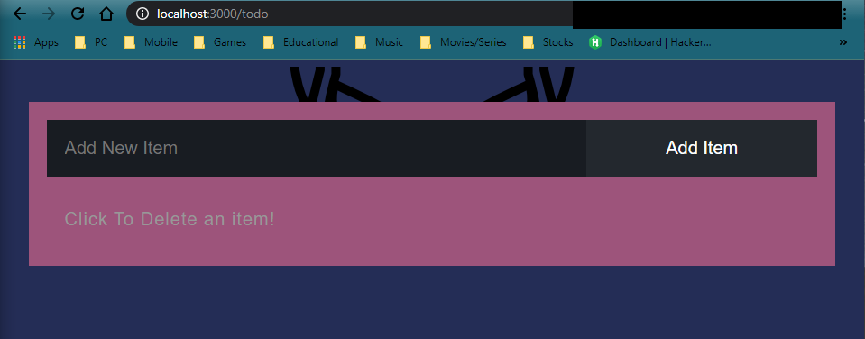

# TodoList Using ExpressJS and MongoDB Atlas
## Screenshot:



Listen on port: 
```bash
localhost:3000/todo
```

Uses can be found in ```package.json```:
- BodyParser: 1.19.0
- EJS: 3.0.1
- Express 4.17.1
- Mongoose 5.8.6
